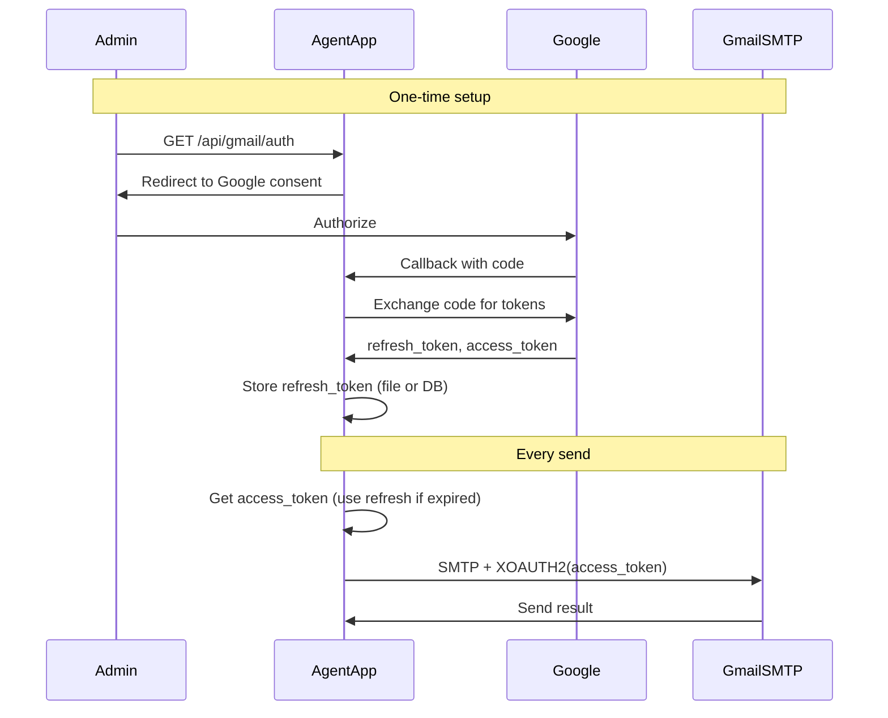

## Gmail OAuth for Agent – Requirements and Plan

## Current state

- **Gmail usage**: Send-only. [robert-agent-service/src/services/emailService.js](robert-agent-service/src/services/emailService.js) uses **nodemailer + SMTP** with `SMTP_USER` and `SMTP_PASSWORD` (Gmail App Password). No OAuth today.
- **Consumers**: Email tool ([tools/email.js](robert-agent-service/src/tools/email.js)), voicemail notifications ([voicemailEmailService.js](robert-agent-service/src/services/voicemailEmailService.js)), and `/api/test/email-connection` in [agent/index.js](robert-agent-service/src/agent/index.js).
- **Env**: `SMTP_USER`, `SMTP_PASSWORD`, `SMTP_HOST`, `SMTP_PORT`, `SMTP_FROM`. SMTP vars are also referenced in [secretsManager.js](robert-agent-service/src/services/secretsManager.js).

---

## Requirements to decide before implementation

| Requirement         | Options                                                                         | Recommendation                                                                                                                        |
| ------------------- | ------------------------------------------------------------------------------- | ------------------------------------------------------------------------------------------------------------------------------------- |
| **Gmail scope**     | Send-only (current) vs send + read (e.g. inbox/search)                          | Send-only unless you need read; keeps scopes and consent minimal.                                                                     |
| **Token storage**   | File (e.g. `gmail-tokens.json`), MongoDB collection, or existing secrets/vault  | File or MongoDB; avoid putting tokens in `.env`. Prefer MongoDB if you already run it and want audit/backup.                          |
| **OAuth flow**      | One-time admin auth (single mailbox) vs multi-user (callback + per-user tokens) | One-time admin auth is enough if one Gmail account is used for the agent.                                                             |
| **Scope of change** | Only `robert-agent-service` vs also `backend/` email services                   | Plan below is for **robert-agent-service** only; backend can be done later if needed.                                                 |
| **Non-Gmail SMTP**  | Keep generic SMTP path when not Gmail?                                          | Yes: keep [emailService.js](robert-agent-service/src/services/emailService.js) logic that uses `SMTP_HOST`/`SMTP_PORT` for non-Gmail. |

---

## Suggested approach

Use **OAuth 2.0 with Gmail SMTP (XOAUTH2)** so you keep nodemailer and only change how the transporter is authenticated. No Gmail API needed for send-only.

---

## Implementation outline

### 1. Google Cloud setup (manual / docs)

- Create or use a project in [Google Cloud Console](https://console.cloud.google.com).
- Enable **Gmail API** (optional for send-only SMTP; useful if you later add read).
- **APIs & Services → Credentials → Create OAuth 2.0 Client ID**:
  - Type: **Web application** (for redirect URI from the agent).
  - Authorized redirect URI: `https://<your-agent-host>/api/gmail/oauth/callback` (and `http://localhost:PORT/...` for dev).
- Note **Client ID** and **Client secret** for env.
- OAuth consent screen: External (or Internal for Workspace). **Scope for SMTP**: use `https://mail.google.com/` (required for Gmail SMTP/XOAUTH2). The narrower `https://www.googleapis.com/auth/gmail.send` scope is for the Gmail REST API only and does **not** work with SMTP (causes 535 auth errors).

### 2. Env and config

- Add (do not commit secrets):
  - `GMAIL_OAUTH_CLIENT_ID`
  - `GMAIL_OAUTH_CLIENT_SECRET`
  - `GMAIL_OAUTH_REDIRECT_URI` (e.g. `https://your-domain/api/gmail/oauth/callback`)
- Optional: `GMAIL_OAUTH_TOKEN_PATH` (file path) or use MongoDB and a collection name.
- Keep `SMTP_USER` / `SMTP_FROM` for the sending identity; remove or stop using `SMTP_PASSWORD` when Gmail OAuth is enabled.

### 3. Token storage module

- New module (e.g. `src/services/gmailTokenStore.js`):
  - **Read**: return `{ access_token, refresh_token, expiry }` from file or MongoDB.
  - **Write**: persist tokens after callback and after refresh.
  - Prefer encrypting tokens at rest if stored in a file; use a key from env (e.g. `GMAIL_TOKEN_ENCRYPTION_KEY`).

### 4. OAuth routes (one-time auth)

- **GET `/api/gmail/auth**`: Build Google consent URL (client_id, redirect_uri, scope, state), redirect user.
- **GET `/api/gmail/oauth/callback**`: Receive `code` (and state); exchange code for tokens; call token store to save; redirect to a simple “Gmail connected” page or return JSON.
- Use `google-auth-library` for token exchange and consent URL (add to robert-agent-service; it is not currently a dependency) or `axios` for token exchange only.

### 5. Gmail OAuth client (refresh and SMTP auth)

- New helper (e.g. `src/services/gmailOAuthClient.js`):
  - **getValidAccessToken()**: If stored access_token is expired, use refresh_token to get a new one, update store, return access_token.
  - Use nodemailer’s built-in OAuth2: `createTransport({ host: 'smtp.gmail.com', port: 465, secure: true, auth: { type: 'OAuth2', user, clientId, clientSecret, refreshToken [, accessToken] } })`. Nodemailer can refresh access tokens automatically when you provide refreshToken + clientId + clientSecret, so a simple token store holding refresh_token (and optional access_token + expiry) is enough.

### 6. Changes to emailService.js

- In `initializeTransporter()`:
  - If Gmail and `GMAIL_OAUTH_CLIENT_ID` (and client secret) are set: create transporter with **OAuth2** (and `getValidAccessToken()`), no `SMTP_PASSWORD`.
  - Else if Gmail + `SMTP_PASSWORD`: keep current App Password path (optional, for migration).
  - Else: keep existing generic SMTP branch.
- Ensure `sendEmail()` and `testConnection()` use the same transporter; `testConnection()` should trigger token refresh if needed.

### 7. Security and ops

- Tokens and client secret only in env or secret store; never in repo.
- Redirect URI must exactly match Google Console; use HTTPS in production.
- Optional: protect `/api/gmail/auth` and `/api/gmail/oauth/callback` with a simple admin secret or IP allowlist.

### 8. Backward compatibility

- Keep non-Gmail SMTP path unchanged (other hosts/ports).
- Optional: support fallback to App Password if OAuth tokens are not present (e.g. first run before “Connect Gmail” is done).

---

## Scope and files to touch

- **New**: `gmailTokenStore.js`, `gmailOAuthClient.js`, OAuth routes (e.g. in agent index or a small `routes/gmailOAuth.js`).
- **Modify**: [emailService.js](robert-agent-service/src/services/emailService.js) (transporter init for Gmail OAuth), [agent/index.js](robert-agent-service/src/agent/index.js) (mount OAuth routes, optional test endpoint update), [secretsManager.js](robert-agent-service/src/services/secretsManager.js) (list new Gmail env vars if you validate them).
- **Docs**: README or internal doc with Google Cloud steps, redirect URI, and “Connect Gmail” one-time flow.

---

## Open decisions (for you)

1. **Token storage**: File vs MongoDB?
2. **Strict OAuth-only for Gmail**: Remove App Password path for Gmail, or keep as fallback during rollout?
3. **Read mail later**: If you might need inbox/search, add scope and Gmail API usage in a later phase; the same tokens can be reused.

---

## Validation summary (double-checked)

- **Scope**: Gmail SMTP with OAuth2 requires `https://mail.google.com/`. The `gmail.send` scope is for the Gmail REST API only and returns 535 when used with smtp.gmail.com. Plan updated accordingly.
- **Nodemailer**: OAuth2 is supported via `auth: { type: 'OAuth2', user, clientId, clientSecret, refreshToken }`; nodemailer can refresh access tokens when refreshToken is provided. Plan uses port 465/secure in the example; 587/requireTLS can be used if preferred.
- **Dependencies**: `robert-agent-service` does not list `google-auth-library`; plan says to add it. Nodemailer is already present (^6.9.0).
- **Current code**: emailService.js and consumers re-verified; file list and scope are correct.

Once you confirm the open decisions above, the plan can be turned into concrete tasks (e.g. “add gmailTokenStore.js”, “add GET /api/gmail/auth”, “wire emailService to OAuth transporter”).